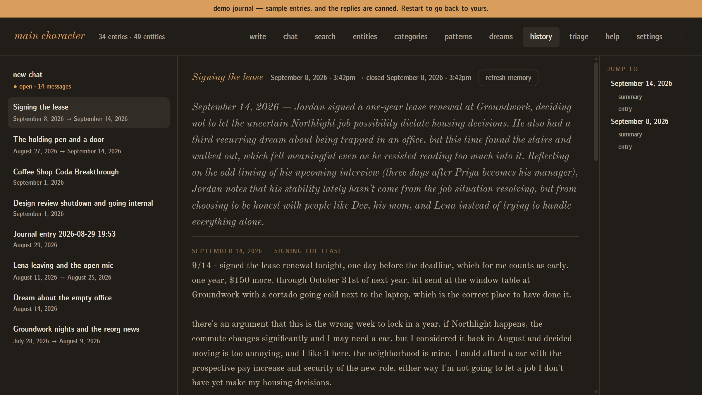

# Main Character

[](https://www.gnu.org/licenses/agpl-3.0)

**A journal that remembers everything you have ever written in it.**

You write an entry. Something you wrote three months ago is relevant, and the
journal knows it — not because you tagged it, but because it went and looked.

That is the whole idea. Everything below is machinery in service of it: a local
vector store so search works by meaning rather than keyword, an entity graph so
the people in your life accumulate a history, rolling summaries so the journal
has a sense of your life at week, month and year scale, and a companion that
reads all of it before answering.



## Start here

Clone it, give it an API key, and start writing. That is the setup — the journal
builds itself out of what you write, from the first entry.

If you happen to have a Claude conversation export, you can import it as a
starting corpus ([below](#importing-a-claude-export)). Most people will not, and
that is fine — it is a bonus for the people who have one, not the front door.

### 1. Install

```bash
git clone https://github.com/ktocdev/main-character.git
cd main-character
python -m venv .venv
.venv/bin/pip install -r requirements.lock      # Windows: .venv\Scripts\pip
```

Python 3.12 or newer. The install is large and slow — it pulls ChromaDB's whole
tree (onnxruntime, tokenizers) so that embeddings run on your machine instead of
over the network. `requirements.txt` lists the same dependencies unpinned, for
reference; install from the lock file.

### 2. Add a key

```bash
cp .env.example .env
```

Uncomment `ANTHROPIC_API_KEY` in `.env` and paste a key from the
[Anthropic Console](https://console.anthropic.com/). Everything else in that
file has a working default.

### 3. Run it

```bash
.venv/bin/python server.py                      # Windows: .venv\Scripts\python.exe
```

The journal opens at **http://127.0.0.1:8144**. Write something in the box and
press *save entry*. That is the loop.

Stop it with `Ctrl+C`. The UI reloads on a browser refresh; Python changes need
a restart.

## Look around first, without a key

There is a demo journal — 30 entries of a fictional life, with the replies
pre-recorded — so you can see what the app is actually like before deciding
whether to pay for it.

```bash
python seed_corpus/import_seed_corpus.py --demo   # one-time, no key, free
.venv/bin/python server.py
```

Then open **Settings → load demo journal**.

The install is free because the embeddings are computed locally, and the replies
are real Claude output captured once and committed to this repo — so nothing
calls the API. In this mode the Anthropic SDK is never even constructed, which
the test suite asserts rather than merely claiming.

The demo is a separate journal with its own data directories, not a mode your
own journal runs in: nothing you type there can reach your entries, and any
restart puts you back. A banner says so the whole time you are in it.

## What it costs

- **Reading, searching and browsing are free.** Embeddings are computed on your
  machine (all-MiniLM-L6-v2). Semantic search never calls an API.
- **Writing costs.** The companion's reply, and the background pass that tags
  the entry, extracts entities and updates summaries.
- **Two models, so you can trade down.** The companion is the voice you actually
  read, and defaults to Opus. Background processing is mechanical, runs in bulk,
  and is where most of the tokens go — it defaults to Sonnet. Both are
  changeable in Settings.
- **Two spend caps**, per session and per calendar month, checked before each
  call. They are runaway detectors rather than budgets, so the defaults sit
  above a heavy month of ordinary writing.
- **The real backstop is not this app.** Every figure it shows is an estimate
  from a hand-maintained price table, and the caps are only as correct as the
  code enforcing them. Set a spend limit on your
  [Anthropic Console](https://console.anthropic.com/settings/limits) account.
  That is the ceiling that holds when this one is wrong.

## Your writing is yours

Everything lives in files on your disk. Three commands, also under
Settings → Data, none of which need a key:

- `python export.py` — the whole journal as a folder: every entry as markdown,
  one `entries.json` with all of them, and everything the pipeline inferred.
  Nothing in it needs this app to read.
- `python backup.py` — the same export as one dated zip. It lands next to the
  journal, on the same disk, so move it somewhere that survives the machine.
- `python rebuild_index.py` — rebuilds the search index from the markdown. Free
  and offline. It is why the export leaves the index out: the index is derived
  from what the export already holds, and this is the command that proves it.

Where it all sits:

| Directory | What |
|---|---|
| `journal_entries/` | Your entries and dreams, as markdown |
| `chroma_data/` | The search index — derived, rebuildable |
| `entity_graph/` | Extracted people, projects and places, with profiles |
| `summaries/` | Entry summaries, weekly arcs, domain docs, the rolling snapshot |
| `categories/`, `patterns/`, `dreams/`, `sessions/` | The rest of the pipeline's output |

All of it is gitignored. None of it leaves your machine except as prompt text
sent to the Anthropic API when you write.

## What it is not

**Single-user, local-only, no authentication — by design, not by omission.**

The server binds to `127.0.0.1` and refuses requests that did not come from
there. There are no accounts, no login and no permission model, because there is
exactly one person: you.

This is load-bearing, not a stage the app will grow out of. The server keeps its
open conversation, its loaded entity index and its Chroma handle in one
process-global dict (`STATE`, [`server.py:80`](server.py#L80)). A second person
on the same instance would not get their own journal — they would get *yours*,
mid-sentence. So:

- Do not expose the port to the internet.
- Do not put it behind a reverse proxy and share the URL.
- A multi-user deployment is not unsupported, it is unsafe.

If you want a journal several people use, this is the wrong codebase to start
from.

## What it does

<details>
<summary><b>The full feature list</b></summary>

### Memory
- **Semantic retrieval** — context assembled in layers: recent entries and the
  current snapshot, then semantically matched chunks, then entity docs, then the
  pattern library
- **Sessions** — one chat stays open for days. Entries, replies and follow-ups
  braid into it and survive restarts. Closing it is the summarize point: your
  side becomes a journal entry, the braid is archived, and the memory pipeline
  runs in the background
- **Reflection** — the companion opens a conversation by connecting threads
  across your history, rather than waiting to be asked

### Entity graph
- **Extraction** — people, projects, places and events, pulled from every entry
- **Profiles** — a living 1–3 paragraph doc per entity, regenerated as context
  accumulates
- **Observations** — timestamped and tagged, browseable per entity by date
- **Groups** — nestable hand-made groupings; a group can roll up so its members
  collapse out of the flat list
- **Triage** — a keyboard-driven review queue for extracted entities (keep,
  merge, correct, rename, alias, retype, delete) with 50-deep undo

### Summaries
- **Entry summaries** — 2–3 sentences per entry, cached incrementally
- **Weekly arcs** — a short narrative per week, stitched from entry summaries
- **Domain summaries** — a ~500-word living doc per category
- **Status snapshot** — one paragraph on where life is right now, updated with
  every entry
- **Seed summary** — a rolling life summary you co-edit, which opens every chat

### Categories
- **Automatic tagging** against ten built-in categories, each of which can be
  turned off
- **Organic categories** — place and project entities clustered by embedding,
  named by Claude, confirmed or dismissed by you
- **Custom categories** — hand-seeded with trigger keywords
- **Parent rollup** — categories can nest

### Patterns
- Recurring emotional cycles, behavioural pipelines and relationship dynamics,
  each tracked with dated instances and a confidence score. Dismissed patterns
  resurface only with new evidence, and they enter the companion's context only
  when the question genuinely rhymes.

### Dreams
- **Realm isolation** — dreams live in their own vector collection, so a waking
  query can never surface one by accident
- **Extraction and flagging** — found in the journal automatically, or marked
  with a checkbox as you write
- **Cast** — dream people and places are spelled to match the waking entity
  graph
- **Dream weather** — a one-line tone signal from recent dreams, appended to the
  snapshot
- **Your interpretations** are captured, never invented

</details>

## Importing a Claude export

Optional, and only useful if you already have one. `python bulk_import.py` reads
a Claude conversation export, chunks it, embeds it and writes markdown backups,
giving the journal a history to reason over from day one. Your messages become
entries; Claude's replies are never stored as journal memory.

## Stack

Python and FastAPI on the backend, ChromaDB for local vector storage, the Claude
API for generation, and plain HTML and vanilla JavaScript on the frontend — no
build step, no frontend dependencies.

## Contributing

There is no `CONTRIBUTING.md` and no PR template, because outside contributions
are not really what this is set up for. If you have found a bug or want
something, open an issue — that is genuinely welcome.

Note the license before building on it: AGPL-3.0-or-later, and the network-use
clause is the part that tends to surprise people. See below.

## Security

See [SECURITY.md](SECURITY.md). Short version: local-only with no auth is the
design, running it exposed to the internet is out of scope by design rather than
a reportable bug, and key handling, prompt injection, XSS in rendered entries
and DNS rebinding are all in scope.

## License

[GNU Affero General Public License v3.0 or later](LICENSE) (AGPL-3.0-or-later).

The Affero clause is the reason for the choice: if you run a modified version of
this app as a network service other people use, you have to offer them its
source. MIT or plain GPL would let a hosted, multi-tenant version of a journal
app be built on this code without that obligation — a sharper problem here than
usual, given what the app is holding.

Every source file carries an `SPDX-License-Identifier: AGPL-3.0-or-later`
header, so a file copied out of this repo still points back at its terms.
